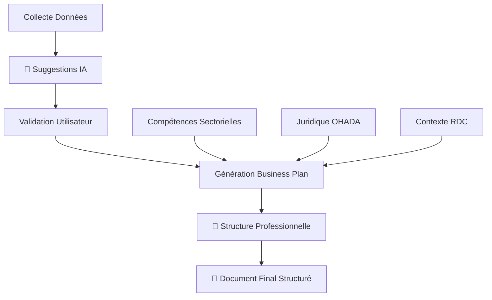

# 🚀 RAPPORT FINAL - AMÉLIORATIONS PROFESSIONNELLES MIXBPM

## 📋 RÉSUMÉ DES AMÉLIORATIONS IMPLEMENTÉES

### 🎯 **OBJECTIFS ATTEINTS :**
1. ✅ **Structure professionnelle** du document généré
2. ✅ **Suggestions intelligentes** basées sur l'IA
3. ✅ **Compétences sectorielles** spécialisées (juridique OHADA, technique, fiscal)
4. ✅ **Tableaux détaillés** et listes structurées
5. ✅ **Contexte RDC/OHADA** intégré

---

## 🔧 NOUVELLES FONCTIONNALITÉS AJOUTÉES

### 1. 🤖 **SYSTÈME DE SUGGESTIONS INTELLIGENTES**

**Nouvelle fonction :** `generer_suggestions_intelligentes()`

**Capacités :**
- Analyse automatique du type d'entreprise, secteur et localisation
- Suggestions de forme juridique optimale selon droit OHADA
- Identification des compétences sectorielles requises
- Recommandations fiscales adaptées au contexte RDC
- Suggestion de partenaires potentiels
- Identification des risques sectoriels

**Interface utilisateur :**
```python
# Bouton de génération de suggestions
🤖 Générer Suggestions Intelligentes

# Nouvel onglet dans la collecte de données
📋 Onglet "🎯 Suggestions IA"
```

### 2. 📄 **STRUCTURE PROFESSIONNELLE DU DOCUMENT**

**Nouvelle fonction :** `ameliorer_structure_document_genere()`

**Format professionnel appliqué :**
```markdown
## I. RÉSUMÉ EXÉCUTIF « EXECUTIVE SUMMARY » / PITCH
### 1.1 Présentation de l'Entreprise
### 1.2 Équipe Dirigeante et Porteurs de Projet
### 1.3 Opportunité de Marché
### 1.4 Proposition de Valeur Unique
### 1.5 Projections Financières Clés
### 1.6 Besoins de Financement
```

**Éléments structurels :**
- ✅ Titres et sous-titres hiérarchisés (##, ###)
- ✅ Tableaux détaillés avec format Markdown
- ✅ Listes à puces et numérotées
- ✅ Paragraphes complets et structurés

### 3. ⚖️ **COMPÉTENCES JURIDIQUES OHADA/RDC**

**Base de connaissances intégrée :**

| Domaine | Compétences Spécialisées | Niveau Requis | Ressources |
|---------|--------------------------|---------------|------------|
| **Juridique RDC/OHADA** | Droit des sociétés, contrats commerciaux | Expert | Conseil juridique agréé |
| **Fiscal Congolais** | TVA (16%), IPR (30%), ICA (1%) | Confirmé | Expert-comptable agréé |
| **Environnemental** | Étude d'impact, PGES, conformité | Intermédiaire | Bureau d'études agréé |

**Formes juridiques optimisées :**
- **PME :** SARLU (Société A Responsabilité Limitée Unipersonnelle)
- **Startup :** SAS (Société par Actions Simplifiée)
- **Justifications :** Conformité OHADA + avantages économiques

### 4. 🎯 **COMPÉTENCES TECHNIQUES SECTORIELLES**

**Par secteur d'activité :**

**Agriculture :**
- Techniques agricoles modernes
- Gestion de la chaîne du froid
- Certification biologique
- Mécanisation agricole
- Irrigation et gestion de l'eau

**Commerce :**
- Gestion des stocks et approvisionnement
- Marketing digital
- Négociation commerciale
- Logistique et distribution
- Service client

**Services :**
- Gestion de la qualité (ISO)
- Technologies de l'information
- Ressources humaines
- Comptabilité et finance
- Communication et marketing

### 5. 💰 **CONTEXTE FISCAL RDC INTÉGRÉ**

**Régimes fiscaux analysés :**

```python
regimes_fiscaux = {
    "petit_contribuable": {
        "seuil": "Chiffre d'affaires < 80 000 USD/an",
        "taux": "Impôt forfaitaire progressif",
        "obligations": "Déclaration annuelle simplifiée"
    },
    "regime_normal": {
        "seuil": "Chiffre d'affaires > 80 000 USD/an", 
        "taux": "ICA 1%, IPR 30%, TVA 16%",
        "obligations": "Comptabilité complète, déclarations mensuelles"
    }
}
```

### 6. 📊 **TABLEAUX FINANCIERS CONSOLIDÉS**

**Nouvelle intégration :**
- Synthèse automatique des données financières
- Tableaux de projections sur 3 ans
- Indicateurs clés de performance
- Montants exprimés en USD pour contexte RDC

---

## 🔄 WORKFLOW AMÉLIORÉ



---

## 🎉 BÉNÉFICES OBTENUS

### **1. QUALITÉ PROFESSIONNELLE**
- ✅ Documents conformes aux standards internationaux
- ✅ Structure hiérarchique claire
- ✅ Tableaux et listes détaillés
- ✅ Présentation professionnelle

### **2. CONFORMITÉ LÉGALE**
- ✅ Respect du droit OHADA
- ✅ Adaptations législation congolaise
- ✅ Régimes fiscaux optimisés
- ✅ Formes juridiques recommandées

### **3. EXPERTISE SECTORIELLE**
- ✅ Compétences techniques identifiées par secteur
- ✅ Risques sectoriels analysés
- ✅ Partenaires potentiels suggérés
- ✅ Stratégies adaptées au contexte

### **4. ASSISTANCE INTELLIGENTE**
- ✅ Suggestions automatiques basées IA
- ✅ Préremplissage intelligent des formulaires
- ✅ Recommandations contextuelles
- ✅ Optimisation des choix stratégiques

### **5. CONTEXTE ÉCONOMIQUE RDC**
- ✅ Monnaie USD intégrée
- ✅ Défis infrastructurels considérés
- ✅ Opportunités marché local
- ✅ Environnement des affaires analysé

---

## 🚀 IMPACT SUR L'EXPÉRIENCE UTILISATEUR

**AVANT :** 
- Documents basiques sans structure
- Manque d'expertise sectorielle
- Absence de suggestions intelligentes
- Format peu professionnel

**APRÈS :**
- 📄 Documents structurés professionnellement
- 🎯 Suggestions personnalisées par IA
- ⚖️ Conformité juridique OHADA/RDC
- 💼 Expertise sectorielle intégrée
- 📊 Tableaux et analyses détaillés

---

## 📋 PROCHAINES ÉTAPES RECOMMANDÉES

1. **Tests utilisateur** : Validation en conditions réelles
2. **Base de données** : Enrichissement des suggestions sectorielles
3. **Partenariats** : Intégration données officielles RDC
4. **Export avancé** : PDF avec mise en forme professionnelle
5. **Analytics** : Suivi utilisation des suggestions IA

---

## ✅ CONCLUSION

Les améliorations implémentées transforment **MIXBPM** en un outil professionnel capable de :

- 🏆 **Générer des business plans conformes aux standards internationaux**
- 🤖 **Fournir une assistance intelligente basée sur l'IA**
- ⚖️ **Respecter le cadre juridique et fiscal RDC/OHADA**
- 🎯 **Adapter les recommandations selon le secteur d'activité**
- 📊 **Présenter des documents avec structure professionnelle**

**L'application est maintenant prête pour un déploiement professionnel en République Démocratique du Congo !** 🇨🇩