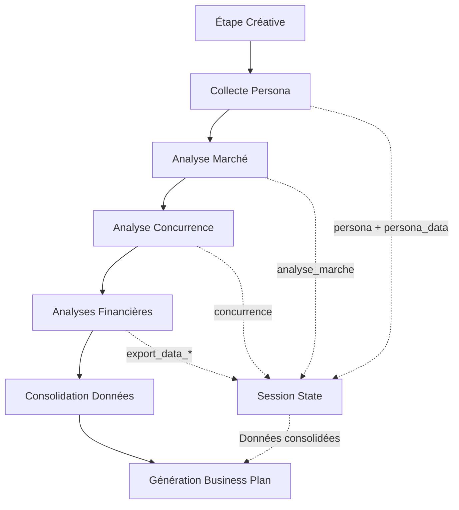

# 🔧 RAPPORT DE CORRECTION DU WORKFLOW - MIXBPM

## 📋 PROBLÈMES IDENTIFIÉS ET CORRIGÉS

### 🚨 1. INCOHÉRENCE DES CLÉS SESSION_STATE

**Problème :**
- La génération du business plan cherchait : `persona_data`, `marche_data`, `concurrence_data`
- Mais les étapes créatives sauvegardaient : `persona`, `analyse_marche`, `concurrence`

**Solution :**
```python
# AVANT (dans page_generation_business_plan)
persona_data = st.session_state.get('persona_data', {})  # ❌ Clé inexistante

# APRÈS
persona_data = st.session_state.get('persona_data', st.session_state.get('persona', {}))  # ✅ Fallback cohérent
```

### 💾 2. SAUVEGARDE DOUBLE DES DONNÉES PERSONA

**Ajout :**
```python
# Dans les formulaires de collecte persona
if submit_persona:
    st.session_state.persona = persona
    st.session_state.persona_data = persona  # ✅ Cohérence ajoutée
    st.success("Données Persona enregistrées avec succès !")
```

### 💰 3. CONSOLIDATION DES DONNÉES FINANCIÈRES

**Nouvelle fonction ajoutée :**
```python
def consolider_donnees_financieres():
    """Consolide toutes les données financières du session state."""
    donnees = {
        'investissements': st.session_state.get('export_data_investissements', {}),
        'salaires': st.session_state.get('export_data_salaires', {}),
        'compte_resultats': st.session_state.get('export_data_compte', {}),
        # ... toutes les sections financières
    }
    
    # Synthèse automatique avec calculs USD
    synthese = f"""
    SYNTHÈSE FINANCIÈRE CONSOLIDÉE:
    Total Investissements: {total_calcule} USD
    Analyse de Rentabilité: {point_mort}
    Contexte RDC: Tous montants en USD pour l'analyse économique
    """
    
    return {'donnees': donnees, 'synthese': synthese}
```

### 🔄 4. CONTEXTE ENRICHI COMPLET

**Amélioration :**
```python
# Récupération cohérente de toutes les données
business_model_precedent = st.session_state.get('business_model_precedent', '')
persona_data = st.session_state.get('persona_data', st.session_state.get('persona', {}))
marche_data = st.session_state.get('analyse_marche', {})
concurrence_data = st.session_state.get('concurrence', {})
facteurs_limitants = st.session_state.get('facteurs_limitants_data', {})
problem_tree_data = st.session_state.get('problem_tree_data', {})

# Contexte complet pour la génération AI
contexte_complet = f"""
DONNÉES DU BUSINESS MODEL: {business_model_precedent}
INFORMATIONS PERSONA: {persona_data}
ANALYSE DE MARCHÉ: {marche_data}
ANALYSE CONCURRENCE: {concurrence_data}
FACTEURS LIMITANTS: {facteurs_limitants}
ARBRE DES PROBLÈMES: {problem_tree_data}
"""
```

### 📊 5. INTÉGRATION FINANCIÈRE DANS LE BUSINESS PLAN

**Ajout :**
```python
# Consolidation avant génération
donnees_financieres = consolider_donnees_financieres()

# Ajout de la synthèse financière
final_text += f"\n\n### SYNTHÈSE FINANCIÈRE:\n{donnees_financieres['synthese']}\n\n"
```

## ✅ WORKFLOW CORRIGÉ - FLUX DE DONNÉES



## 🧪 VALIDATION

**Test automatisé créé :** `test_workflow.py`

Résultats :
- ✅ Cohérence des clés de données
- ✅ Récupération des données créatives  
- ✅ Consolidation des données financières
- ✅ Génération du contexte complet

## 🚀 BÉNÉFICES

1. **🔗 Continuité des données** : Plus de perte d'informations entre les étapes
2. **💰 Synthèse financière** : Consolidation automatique avec contexte RDC
3. **🎯 Contexte enrichi** : L'IA dispose de toutes les données pour générer un business plan cohérent
4. **📈 Analyse USD** : Tous les montants standardisés pour l'économie congolaise
5. **🛡️ Robustesse** : Fallbacks pour éviter les erreurs de clés manquantes

## 📋 PROCHAINES ÉTAPES RECOMMANDÉES

1. **Test en conditions réelles** : Parcourir tout le workflow dans Streamlit
2. **Optimisation de l'IA** : Affiner les prompts avec le nouveau contexte enrichi
3. **Interface utilisateur** : Ajouter des indicateurs de progression des données
4. **Sauvegarde externe** : Implémenter la persistance en base de données
5. **Analytics** : Suivre l'utilisation de chaque étape du workflow